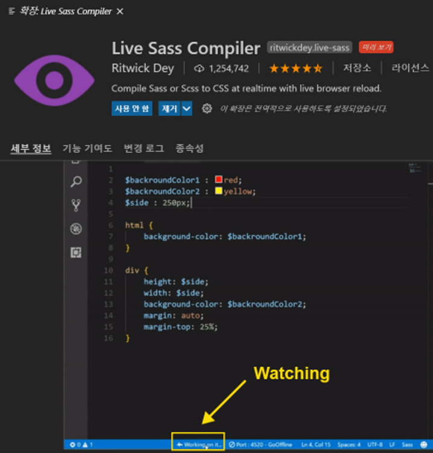

# CH01.  에디터 설치 - Window

##   

## 1. 수업에 필요한 프로그램 설치

###   

### 1)  수업 진행을 위한 환경설정

→   Node.js, node-sass, VSCode, Window Git, Git Bash 준비

  

### 설치 프로그램 목록

  

**1) Node JS   -  [https://nodejs.org/en/](https://nodejs.org/ko/)    (  LTS 안정화 버전으로 최신 버전 설치 )**

**2) VScode   -  [https://code.visualstudio.com/](https://code.visualstudio.com/)** 

**3) Window & Mac Git  -  [https://git-scm.com/](https://git-scm.com/)**


  

---

  

### \[  윈도우 깃 기본 명령어   \]

  

##### 1) 디렉토리 이동 및 생성하기       `cd`, `mkdir`

##### 2) 파일 생성                  `touch`, `echo`

##### 3) 내용 확인                  `cat`

##### 4) 목록 출력                  `ls`, `ls -1`

##### 5) 이동/이름 변경          `mv`

##### 6) 복제                           `cp`

##### 7) 제거                           `rmdir`, `rm`, `rm -rf`

  

  

#### 커멘드 명령어 실습 테스트 

##### \- 아래 순서대로 작성하면서 확인해 보시기 바랍니다!

  

1\. ls 

2.touch test.html main.css 

3\. mkdir css 

4\. mv main.css css/main.css 

5\. rm test.html

  

---

  

## 2. VSCode 소개 및 확장 프로그램 설치

  

### 1) VSCode 소개

  

Microsoft에서 만든 텍스트 편집기입니다. VSCode라고 줄여서 말하기도 합니다. 비주얼 스튜디오 코드는 가볍고, 맥,리눅스,윈도우에서 모두 실행 가능하고, 무료인 코드편집기입니다. Sublimetext, Atom 에디터의 장점들을 잘 모아 만든 에디터입니다. 특히 서브라임텍스트의 한글입력 문제,인코딩 문제를 깔끔히 해결한 에디터입니다. 다양한 언어를 지원하며, 확장 프로그램을 통해 에디터 기능을 확장시킬수 있습니다.
  

  

### 2)  비주얼스튜디오 익스텐션 설치

  

\* 설치시 제작자가 있는 익스텐션들은 확인 후 설치하시면 됩니다.

  

1. Bracket Pair Colorizer / Rainbow Brackets
2. Live Server
3. vscode-icons (Linux & Windows => File > Preferences > File Icon Theme > VSCode Icons.)
4. Color Highlight
5. Auto Rename Tag
6. Auto Close Tag
7. autofilename
8. Beautify
9. Code Spell Checker
10. HTML Snippets : 제작자 - Mohamed Abusaid
11. jquery Code Snippets : 제작자 - Don Jayamanne
12. IntelliSense for CSS class names in HTML  : 제작자 - Zignd
13. hex-rgba converter
14. Live Sass Compiler : 제작자 - Glenn Marks
15. Calculator

  

  

#### Live SASS Compiler 설치 후 체크사항

###   

### \[ settings.json \]

#### "liveSassCompile.settings.formats": \[

 **{**

   **"format": "expanded",  
   // expanded, compact, compressed, nested** 

  **"extensionName": ".css", "savePath": "/css"** 

 **}**

 **\],** 

**"liveSassCompile.settings.generateMap" : false,**

  

####   

  

  

  

### 3) VSCode 환경설정하기

  

- **VSCode 환경 설정 파일인 ‘setting.json’ 파일 내용을 아래 코드로 덮어쓰기 할 것!**

  

```json
{
    "editor.fontFamily": "D2Coding",
    "workbench.sideBar.location": "left",
    "liveServer.settings.CustomBrowser": "chrome",
    "editor.fontSize": 26,
    "editor.tabSize": 2,
    "terminal.integrated.fontSize": 26,
    "editor.wordWrap": "on",
    "editor.wordWrapColumn": 40,
    "workbench.startupEditor": "newUntitledFile",
    "[html]": {
        "editor.defaultFormatter": "HookyQR.beautify"
    },
    "liveServer.settings.donotShowInfoMsg": true,
    "open-in-browser.default": "chrome",
    "beautify.language": {
        "js": {
            "type": ["javascript", "json"],
            "filename": [".jshintrc", ".jsbeautifyrc"]
            // "ext": ["js", "json"]
            // ^^ to set extensions to be beautified using the javascript beautifier
        },
        "css": ["css","sass","scss"],
        "html": ["htm", "html"]
        // ^^ providing just an array sets the VS Code file type
    },
    "liveServer.settings.donotVerifyTags": true,
    "breadcrumbs.enabled": false,
    "liveSassCompile.settings.formats": [   
        {
            "format": "expanded",    // expanded, compact, compressed, nested
            "extensionName": ".css",
            "savePath": "/css"
        }
    ],
    "liveSassCompile.settings.generateMap" : false,
    "vsicons.dontShowNewVersionMessage": true,
    "liveSassCompile.settings.autoprefix": [],
    "security.workspace.trust.untrustedFiles": "open",
    "terminal.external.windowsExec": "C:\\Program Files\\Git\\bin\\bash.exe",
    "terminal.integrated.defaultProfile.windows": "Git Bash",
    "terminal.integrated.profiles.windows": {
        "C:\\WINDOWS\\System32\\WindowsPowerShell\\v1.0\\powershell.exe (migrated)": {
            "path": "C:\\WINDOWS\\System32\\WindowsPowerShell\\v1.0\\powershell.exe",
            "args": []
        }
    },
    "terminal.integrated.automationShell.windows": "C:\\Program Files\\Git\\bin\\bash.exe",
    "explorer.confirmDelete": false,
    "debug.disassemblyView.showSourceCode": false,
    "bracketPairColorizer.depreciation-notice": false,
    "files.associations": {"*html":"html"},
    "emmet.triggerExpansionOnTab": true,
    "aicodehelper.gptkey": "****",
    "aicodehelper.language": "korea"
}
```

  

  

  

### 4) 추가 설치 테마변경

1\. 테마 설치하기 : Monokai Dark Soda  
2\. 테마 설정하기 : Preference( Ctrl+Shift+P )실행 -> Preference : Color Theme 선택 -> 지정할 테마 선택  
  

  

### 5) VSCode 기본 단축키

#### 1) 기본편집 관련 단축키

1. alt + 원하는 행 선택      :   개별 선택 지정
2. ctrl + X                           :   행 삭제
3. ctrl + C                           :   행 복사
4. shift+alt+Down           :   위에 행 복사 추가
5. shift+alt+Up                 :   아래에 행 복사 추가
6. alt + Down                    :   행을 아래로 이동
7. alt + Up                          :   행을 위로 이동
8. ctrl + d                           :   다음 선택 찾기
9. ctrl + \]                            :   라인 들여쓰기
10. ctrl + \[                            :   라인 내어쓰기
11. ctrl + Shift + l               :   이후에 오는 같은 단어 한번에 선택하기

  

#### 2) 파일 관련 단축키

1. ctrl + n                              :   새탭 열기
2. ctrl + o                              :   파일 열기 
3. ctrl + s                               :   저장
4. ctrl + ks                             :   모두 저장
5. ctrl + shift+s                    :   다른 이름으로 저장

  

#### 3) 디스플레이 관련 단축키

1. f11                                     :   전체 화면 토글
2. ctrl + =                              :    확대
3. ctrl + -                               :    축소
4. ctrl + b                              :    사이드바 토글
5. ctrl + q                              :    명령창에서 빠른 열기
6. ctrl + \`                                :   통합 터미널 토글